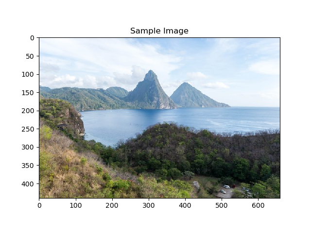

# Simple-Art-Generator-using-VGG19-Convolutional-Neural-Network
In this project, I try a simple application of Deep Neural Network: drawing art using pretrained model. The model is the VGG19 Convnet proposed Karen Simonyan and Andrew Zisserman. The objective of the project is: given a random input, which is an image of any kind (car, girl, nature, etc), the convolutional neural network will be utilized to analyze the image and try to draw it from a blank paper. In this project, I have slowed down the drawing process to show how the neural network draw the picture step-by-step. In other words, how the drawing starts looking like the original picture.

The intuition is that a convolutional neural network has been train to recognize objects pretty well, especially the one with large structure like the VGG19. Once we have the brain, something that have learned to "conceive" objects, we can use that "brain" to do many tasks, such as drawing. The brain here is the pretrained VGG19. You can take a look at my project "A-Close-Examination-of-Activations-in-Deep-Convolutional-Neural-Network--Visualiazing-Deep-ConvNet" to have a better intuition. If you want to understand how to teach the brain to conceive things, or to train a neural network from scratch, please look at my first project "Neural-Network-from-Scratch--Hand-written-Digits-classifier" for some math explanations.

Explanation of the main idea: normally, we try to optimize parameters in neural network to have the lowest cost. In this project, parameters are the pixels in the blank paper, and the cost measure how different the activations of the current product with those of the original picture.

Link to the video showing how the NN learn to draw the picture: https://photos.google.com/u/2/search/_tv_Video/photo/AF1QipMks2ovhARzlyeZm71KUrbsGd59Bsep00ZsY1Q9

**Note that the point is not to imitate the picture, but to draw the picture from a blank paper so that it looks like a DRAWING of the picture, not an imitation! This explains why the final result does not look 100% like the original one, but more like a drawing!**

Here are some images showing how the NN draw the picture:
Sample picture:

